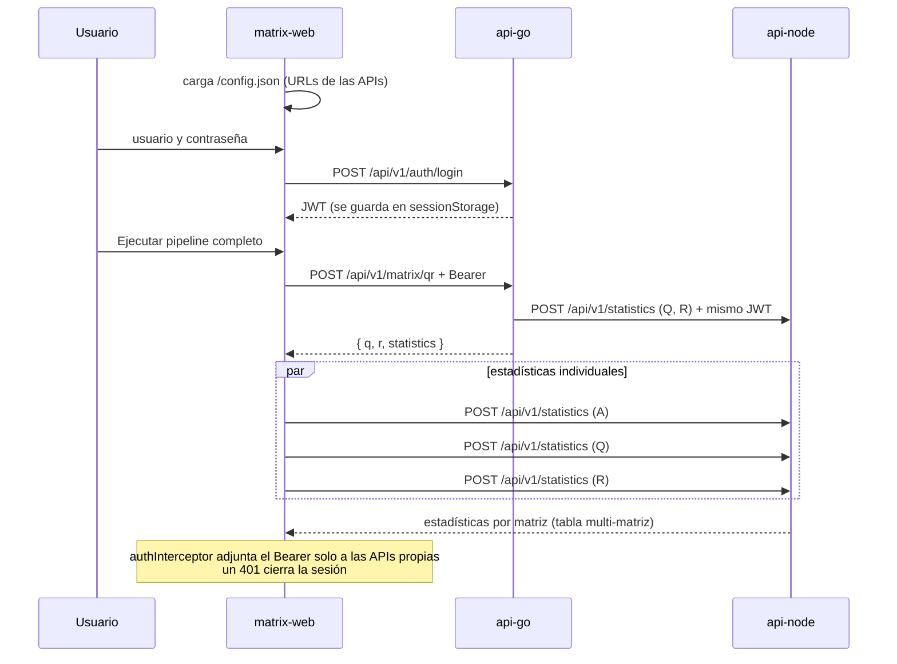

# matrix-web · Consola MatrixCore

Frontend en **Angular 21 (zoneless + signals) + Tailwind CSS v4** que consume las dos APIs del reto:

- **api-go** (Go + Fiber): login con JWT y factorización QR por rotaciones de Givens.
- **api-node** (Node + Express): estadísticas (máximo, mínimo, promedio, suma) y diagnóstico de matriz diagonal.

Es un **servicio autónomo** (repositorio, build, Docker y CI propios). Se comunica con las APIs solo por HTTP
desde el navegador. Decisiones de diseño: [ADR-003](docs/architecture/ADR-003-frontend.md).

## Contenido
- [Páginas y funcionalidades](#páginas-y-funcionalidades)
- [Flujo de autenticación y datos](#flujo-de-autenticación-y-datos)
- [Seguridad y flujo HTTP: guards, interceptores y telemetría](#seguridad-y-flujo-http-guards-interceptores-y-telemetría)
- [Health checker](#health-checker)
- [Configuración](#configuración-tú-defines-los-valores-no-hay-secretos)
- [Ejecutar](#ejecutar)
- [Pruebas: cómo lanzarlas](#pruebas-cómo-lanzarlas)
- [Arquitectura y estructura](#arquitectura-y-estructura)
- [Docker](#docker)
- [Despliegue en AWS](#despliegue-en-aws)
- [Integración continua](#integración-continua)
- [Problemas frecuentes](#problemas-frecuentes)
- [Reglas de contribución](#reglas-de-contribución)

## Páginas y funcionalidades

Cada apartado de la consola es **una página independiente** (ruta propia, carga diferida). El estado (matriz,
resultados, tiempos) vive en `ConsoleStore`, compartido por todas las páginas, así se conserva al navegar.

| Ruta | Página | Qué hace | API |
|---|---|---|---|
| `/login` | Login | Obtiene el JWT HS256; muestra si las APIs están en línea | api-go `POST /auth/login` |
| `/resumen` | Resumen | Cabecera del pipeline, indicadores (dimensión, tiempos, Q×R=A, diagonal), **health checker**, acciones y accesos a cada módulo | ambas `GET /health` |
| `/matriz` | Matriz de entrada | **Matriz personalizada** (filas × columnas de 1 a 100 + relleno), presets, grilla editable (hasta 12×12) y panel JSON | — |
| `/qr` | Factorización QR | Q y R, verificación ‖QR − A‖ y ‖QᵀQ − I‖, rango numérico, explicación del algoritmo de Givens | api-go `POST /matrix/qr` |
| `/estadisticas` | Estadísticas | Máximo, mínimo, promedio, suma, diagnóstico diagonal y tabla multi-matriz (A, Q, R) | api-node `POST /statistics` |
| `/red` | Red & JWT | Inspector de peticiones (estado, duración, JSON, copiar) y claims del token | — |

**Acciones** (en Resumen y Matriz): **Estadísticas directas (Node)**, **Calcular factorización QR (Go)** y
**Ejecutar pipeline completo (Go → Node)**. Al terminar, ofrecen atajos a las páginas de resultados.
Los errores de cualquier API se muestran en un banner global, en la página donde estés.

### Matriz personalizada
En **/matriz** eliges **filas (m)** y **columnas (n)**, entre 1 y 100 (el límite de la API), y un relleno:

| Relleno | Resultado |
|---|---|
| Conservar valores | Redimensiona manteniendo los valores existentes y completa con ceros |
| Aleatoria | Enteros entre −20 y 20 |
| Ceros | Matriz nula |
| Identidad | Unos en la diagonal principal (también rectangular) |

Hasta 12×12 la matriz se edita celda por celda; más grande, desde el panel JSON (que siempre refleja el cuerpo exacto
de `POST /api/v1/matrix/qr`). El formulario valida el rango antes de crear la matriz.

## Flujo de autenticación y datos



## Seguridad y flujo HTTP: guards, interceptores y telemetría

Toda petición a las APIs pasa por dos interceptores funcionales, en este orden (`app.config.ts`):

```
componente/store → ApiGoService/ApiNodeService → telemetryInterceptor → authInterceptor → HttpClient (fetch) → API
```

| Pieza | Archivo | Responsabilidad |
|---|---|---|
| **AuthService** | `core/auth/auth.service.ts` | Única fuente de verdad del JWT (signals). `login()` lo guarda en **sessionStorage**; `isAuthenticated` = token con `exp` futuro; un vigilante cada 15 s cierra la sesión al vencer; `logout(reason)` limpia y vuelve a `/login`. |
| **authGuard** | `core/auth/auth.guards.ts` | Protege la consola (`/resumen`, `/matriz`, `/qr`, `/estadisticas`, `/red`): sin token vigente redirige a `/login` devolviendo un `UrlTree`. |
| **guestGuard** | `core/auth/auth.guards.ts` | Evita mostrar el login a quien ya tiene sesión (lo envía a la consola). |
| **telemetryInterceptor** | `core/telemetry/telemetry.interceptor.ts` | **Primero** en la cadena: mide duración, estado y cuerpos de cada petición y la registra en `TelemetryService`. Enmascara la contraseña del login y reemplaza el token por `<jwt>`. Las peticiones marcadas con `SKIP_TELEMETRY` (el sondeo de `/health`) no se registran. |
| **authInterceptor** | `core/auth/auth.interceptor.ts` | Agrega `Authorization: Bearer <token>` **solo** a `apiGoUrl` y `apiNodeUrl` (nunca a terceros) y nunca al login. Si una API responde **401**, cierra la sesión como *expirada* y re-lanza el error. |
| **TelemetryService** | `core/telemetry/telemetry.service.ts` | Historial en memoria de las últimas 25 peticiones (`entries`, `latest`), mostrado en **/red**. No se persiste ni se envía a ningún servidor. |

Cada entrada de telemetría registra: servicio (`api-go` / `api-node` / `externo`), método, URL, estado HTTP
(`0` = sin respuesta por red o CORS), duración medida en el navegador, hora, si la ruta es protegida y los cuerpos de
petición y respuesta (sin secretos).

## Health checker

`HealthService` (`core/health/health.service.ts`) vigila la disponibilidad de ambas APIs desde el navegador:

- **Qué consulta:** `GET {apiGoUrl}/health` y `GET {apiNodeUrl}/health` (públicos, sin JWT, excluidos de la telemetría).
- **Cuándo:** una verificación inmediata al abrir el login o la consola y luego cada `healthPollMs` (15 s por
  defecto, configurable en `config.json` o `HEALTH_POLL_MS`). El botón **⟳ Verificar ahora** de `/resumen` llama a `refresh()`.
- **Estados:** `checking` (sin respuesta aún) · `up` (respondió 2xx; guarda la latencia en ms) · `down` (error HTTP,
  timeout, red caída o CORS). Un fallo nunca detiene el sondeo: el servicio vuelve a `up` cuando se recupera.
- **Dónde se ve:** en la barra superior (punto verde, amarillo o rojo con latencia), en la tarjeta *Health checker* de
  `/resumen` (URL, estado, latencia y hora de la última verificación) y en el login (online/offline).
- **Diseño:** `providedIn: 'root'` y `start()` idempotente, así login y consola comparten un solo sondeo; con
  `switchMap` nunca hay dos verificaciones del mismo servicio en vuelo.

Este health checker complementa los del backend: `HEALTHCHECK` de Docker (api-node y el nginx del frontend en
`/healthz`) y los health checks del balanceador de AWS contra `/health` y `/healthz` (ver `deploy/aws/service.yml`).

---

## Configuración (tú defines los valores; no hay secretos)

El frontend no tiene secretos: todo lo que llega al navegador es público. El JWT se obtiene en tiempo de ejecución
con usuario y contraseña. Solo hay que decirle **dónde están las APIs**. Hay dos formas, según cómo lo ejecutes.

### A. Desarrollo local (`npm start`): `public/config.json` (opcional)
Si las APIs corren en `localhost:8080` y `localhost:3000`, **no necesitas configurar nada**: esos son los valores por defecto.
Para otras URLs:
```bash
cp public/config.example.json public/config.json   # está en .gitignore
```
```json
{
  "apiGoUrl": "http://localhost:8080",
  "apiNodeUrl": "http://localhost:3000",
  "healthPollMs": 15000
}
```

### B. Docker / nube: variables de entorno
Al arrancar el contenedor, `docker/40-app-config.sh` genera `/config.json` desde estas variables, así **la misma
imagen sirve en cualquier entorno** sin recompilar:
```bash
cp .env.example .env    # está en .gitignore
```
| Variable         | Default                 | Descripción                                                      |
|------------------|-------------------------|------------------------------------------------------------------|
| `API_GO_URL`     | http://localhost:8080   | URL **pública** de api-go (la que usa el navegador)              |
| `API_NODE_URL`   | http://localhost:3000   | URL **pública** de api-node                                      |
| `HEALTH_POLL_MS` | 15000                   | Intervalo de sondeo de `/health`                                 |
| `WEB_PORT`       | 4200                    | Puerto del host donde se publica el frontend                     |

> **Dos reglas importantes**
> 1. Las URLs son las que ve el **navegador**, no la red interna de Docker. En tu máquina, `http://localhost:8080`
>    es correcto aunque todo corra en contenedores. En la nube, usa las URLs públicas de cada API.
> 2. El origen del frontend (p. ej. `http://localhost:4200` o `https://matrix.midominio.com`) debe estar en
>    `CORS_ALLOWED_ORIGINS` del `.env` de **api-go y de api-node**; si no, el navegador bloquea las peticiones.

---

## Ejecutar

### Docker (recomendado)
```bash
docker compose up --build        # http://localhost:4200
```

### Local
```bash
npm install
npm start                        # http://localhost:4200
```
Requiere Node 22 LTS (Angular 21 no soporta oficialmente versiones impares como Node 25).

Luego inicia sesión con las credenciales de demo definidas en el `.env` de api-go (`AUTH_USERNAME` / `AUTH_PASSWORD`).

## Pruebas: cómo lanzarlas

Las pruebas usan **Vitest** con el builder de Angular (`@angular/build:unit-test`) y `TestBed` en modo zoneless.

| Qué quieres | Comando |
|---|---|
| Todas, una sola pasada (igual que el CI) | `npm run test:ci` |
| Modo watch mientras desarrollas | `npm test` |
| Solo un archivo o carpeta | `npx ng test --watch=false --include="src/app/core/auth/**/*.spec.ts"` |
| Build de producción (con presupuestos de tamaño) | `npm run build` |

**Qué cubren (76 pruebas en 9 archivos):**

| Archivo | Cubre |
|---|---|
| `core/config/app-config.spec.ts` | Configuración de ejecución: `config.json`, valores por defecto, URLs inválidas, errores de red |
| `core/auth/jwt.spec.ts` | Decodificación del JWT (UTF-8, tokens mal formados) y segundos restantes |
| `core/auth/auth.spec.ts` | AuthService, **authInterceptor** (Bearer solo a APIs propias, 401 → logout) y **telemetryInterceptor** (sin contraseña ni token) |
| `core/health/health.service.spec.ts` | **Health checker**: up/down, latencia, `refresh()`, recuperación, idempotencia y exclusión de la telemetría |
| `core/api/api-error.spec.ts` | Normalización de errores (formato de las APIs, red, desconocidos) |
| `shared/matrix/matrix-math.spec.ts` | Matriz personalizada (rellenos, límites 1..100), verificación QR, rango, validación y formato |
| `features/console/console.store.spec.ts` | Pipeline Go → Node, errores, resultados desactualizados, acciones concurrentes y matriz personalizada |
| `features/console/components/matrix-editor.component.spec.ts` | Formulario de dimensiones, validación, grilla vs. JSON y edición de celdas |
| `features/auth/login.page.spec.ts` | Login: validación, navegación y mensajes de error |

> **Windows con Smart App Control:** si Vitest falla con `Cannot find module @rollup/rollup-win32-x64-msvc`,
> Windows está bloqueando el binario nativo. Corre las pruebas en contenedor (mismo entorno que el CI):
> `docker run --rm -v "${PWD}:/app" -v matrixweb_node_modules:/app/node_modules -w /app node:22-alpine sh -c "npm ci && npm run test:ci"`

## Arquitectura y estructura
```
matrix-web/
├── src/
│   ├── main.ts                    Carga /config.json y arranca Angular
│   ├── styles.css                 Sistema de diseño Tailwind v4 (@theme + @utility)
│   ├── testing/                   Helpers de prueba (TEST_CONFIG, fakeJwt, validJwt)
│   └── app/
│       ├── app.config.ts          Router, HttpClient (fetch) + interceptores, APP_CONFIG
│       ├── app.routes.ts          Rutas con carga diferida y guards
│       ├── core/                  config · api (DTOs y clientes) · auth · telemetry · health
│       ├── shared/                matrix (validación, presets, verificación QR) · ui (componentes presentacionales)
│       ├── layout/                Shell autenticado (sidebar + estado de servicios)
│       └── features/
│           ├── auth/              login.page.ts
│           └── console/           console.routes.ts · console.store.ts
│               ├── pages/         resumen · matriz · qr · estadisticas · red
│               └── components/    editor de matriz · acciones · tabla · inspector · estado vacío
├── public/                        favicon · config.example.json
├── docker/                        nginx.conf · 40-app-config.sh (genera config.json)
├── deploy/aws/                    service.yml (CloudFormation) + deploy.sh
├── Dockerfile                     Build Node 22 → nginx alpine
└── docker-compose.yml             Ejecución aislada
```
- Estado con **signals** (`ConsoleStore` compartido por las páginas vía `providers` de la ruta, `AuthService`, `HealthService`); los componentes no hacen HTTP.
- Comentarios con la convención **Better Comments**: `// *` punto clave, `// !` advertencia o seguridad, `// ?` decisión de diseño, `// TODO:` pendiente.
- `telemetryInterceptor` → `authInterceptor`: mide cada petición y adjunta el Bearer solo a las APIs configuradas.
- SPA estática servida por **nginx** (fallback de rutas, caché de assets con hash, `config.json` sin caché).

## Docker
- **Imagen:** build con `node:22-alpine` y servida con `nginx:1.29-alpine`: fallback de rutas de la SPA, caché
  inmutable de los assets con hash, `config.json` sin caché, cabeceras de seguridad y `/healthz`.
- Al arrancar, `docker/40-app-config.sh` escribe `/config.json` con `API_GO_URL`, `API_NODE_URL` y `HEALTH_POLL_MS`.
- `docker compose up --build` levanta el frontend solo en `${WEB_PORT:-4200}`.

## Despliegue en AWS
Se despliega en **ECS Fargate** detrás del ALB compartido, en el puerto **80**
([guía completa](docs/deploy/aws.md), [ADR-004](docs/architecture/ADR-004-despliegue-aws.md)).

```bash
# Crea la plataforma compartida (red, ALB, clúster, secretos) si aún no existe; luego despliega este servicio
./deploy/aws/deploy.sh
```
En AWS no hace falta `.env`: la plantilla fija `API_GO_URL=http://<ALB>:8080` y `API_NODE_URL=http://<ALB>:3000`,
y las APIs ya aceptan el origen `http://<ALB>` por CORS. Para otras URLs (p. ej. con dominio propio):
`PARAM_OVERRIDES="ApiGoUrl=https://api-go.midominio.com ApiNodeUrl=https://api-node.midominio.com" ./deploy/aws/deploy.sh`.
Parámetros de [`deploy/aws/service.yml`](deploy/aws/service.yml): `DesiredCount`, `ApiGoUrl`, `ApiNodeUrl` y `HealthPollMs`.

**¿Usas ECS Express Mode desde la consola?** Usa `./deploy/aws/express-deploy.sh` (configura puerto, health check, variables y secretos, y tiene un modo `diagnose`) y consulta [docs/deploy/aws-express.md](docs/deploy/aws-express.md).

**Costo y limpieza.** Los tres servicios comparten un solo balanceador y usan Fargate Spot: ≈ US$ 45 al mes si quedan
encendidos 24/7 y centavos para una demo de horas ([detalle](docs/deploy/aws.md#4-costos-estimados)). Pausar:
`PARAM_OVERRIDES="DesiredCount=0" ./deploy/aws/deploy.sh`. Eliminar: `CONFIRM=si ./deploy/aws/destroy.sh` (agrega
`DESTROY_PLATFORM=si` en el último servicio para borrar también la plataforma).

## Integración continua
[`.github/workflows/ci.yml`](.github/workflows/ci.yml): un solo job que corre `npm ci` → pruebas (Vitest) → build de producción → build de la imagen Docker (sin publicarla).
Pensado para costo mínimo: ignora cambios solo de documentación, cancela ejecuciones repetidas de la misma rama y
**no despliega ni usa servicios de AWS** (el despliegue es manual con `./deploy/aws/deploy.sh`).

## Problemas frecuentes
| Síntoma | Causa y solución |
|---|---|
| Una API aparece "sin conexión" | La URL configurada no es correcta o la API no está levantada. Revisa `public/config.json` o `API_GO_URL`/`API_NODE_URL` |
| Error de red o CORS al iniciar sesión | El origen del frontend no está en `CORS_ALLOWED_ORIGINS` de las APIs |
| La sesión se cierra sola | El token expiró (`JWT_TTL_MINUTES` en api-go) o una API respondió 401 |
| `Cannot find module @rollup/rollup-win32-x64-msvc` | Smart App Control de Windows: corre las pruebas en contenedor (ver [Pruebas](#pruebas)) |
| Advertencia "Node.js v25 ... unsupported" | Usa Node 22 LTS para desarrollar |

## Reglas de contribución
Todo cambio incluye: **pruebas** nuevas o actualizadas, **documentación** al día (este README, `.claude/CLAUDE.md`,
DTOs) y **Docker y despliegue** revisados si cambian la configuración de ejecución o el build (`Dockerfile`, `docker/`,
`.env.example`, `public/config.example.json` y `deploy/aws/service.yml`).
