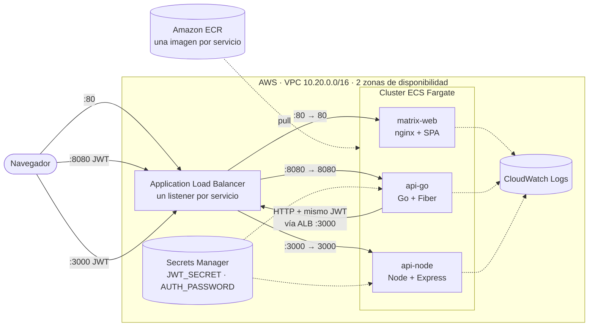

# Despliegue en AWS (Docker + ECS Fargate)

Guía para publicar los tres servicios (api-go, api-node y matrix-web) en Amazon Web Services usando sus imágenes
Docker. Cada servicio vive en **su propio repositorio** y se despliega **por separado** con `./deploy/aws/deploy.sh`.
Toda la infraestructura es código (**CloudFormation**). Este mismo documento está copiado en los tres repositorios.
Decisión y alternativas: [ADR-004](../architecture/ADR-004-despliegue-aws.md).

## Contenido
1. [Arquitectura](#1-arquitectura)
2. [Qué archivo hace qué](#2-qué-archivo-hace-qué)
3. [Requisitos previos](#3-requisitos-previos)
4. [Costos estimados](#4-costos-estimados)
5. [Despliegue paso a paso](#5-despliegue-paso-a-paso)
6. [Verificar y usar el sistema](#6-verificar-y-usar-el-sistema)
7. [Actualizar un servicio](#7-actualizar-un-servicio)
8. [Operación: logs, escalado y secretos](#8-operación-logs-escalado-y-secretos)
9. [Problemas frecuentes](#9-problemas-frecuentes)
10. [Eliminar todo](#10-eliminar-todo)
11. [Endurecimiento para producción](#11-endurecimiento-para-producción)

---

## 1. Arquitectura



| Pieza | Para qué |
|---|---|
| **VPC + 2 subredes públicas** | Red propia en dos zonas de disponibilidad. Sin NAT Gateway (ahorra unos US$ 32 al mes): las tareas reciben IP pública para descargar imágenes, pero su security group **solo acepta tráfico del ALB**. |
| **Application Load Balancer** | Único punto de entrada con **un listener por servicio**: `:80` frontend, `:8080` api-go, `:3000` api-node. Así cada servicio conserva su puerto y sus rutas (`/health`, `/docs`, `/api/v1/...`) sin chocar entre sí, y no se necesita dominio propio. |
| **ECS Fargate** | Ejecuta los contenedores sin administrar servidores. Cada servicio tiene su *task definition*, su servicio ECS y **rollback automático** si la versión nueva no pasa el health check. |
| **ECR** | Registro privado de imágenes, con escaneo de vulnerabilidades al publicar. |
| **Secrets Manager** | Genera `JWT_SECRET` (64 caracteres, compartido por api-go y api-node) y `AUTH_PASSWORD`. ECS los inyecta como variables de entorno: **nunca** están en el repositorio ni en las plantillas. |
| **CloudWatch Logs** | Logs de cada contenedor (`/ecs/retotecnico/<servicio>`, retención de 14 días). |

## 2. Qué archivo hace qué

Cada repositorio tiene la misma carpeta `deploy/aws/`:

```
deploy/aws/
├── service.yml           Pila de ESTE servicio: task definition, rol, logs, target group, listener y servicio ECS
├── deploy.sh             Build → ECR → CloudFormation (crea la plataforma si aún no existe)
├── platform.yml          Plataforma compartida: VPC, ALB, cluster, security groups y secretos (copia idéntica en los 3 repos)
├── deploy-platform.sh    Crea o actualiza explícitamente la plataforma (solo si cambias platform.yml)
├── outputs.sh            Muestra las URLs públicas y la contraseña de demo
└── destroy.sh            Elimina este servicio (y la plataforma si ya nadie la usa)
```

**Un solo balanceador para los tres repositorios.** La plataforma es una pila compartida (`retotecnico-platform`): el
primer `deploy.sh` que se ejecute la crea y los siguientes la reutilizan. `deploy.sh` **nunca** la actualiza (así un
repositorio no pisa la configuración de otro); para cambiarla se usa `deploy-platform.sh`, con las tres copias de
`platform.yml` iguales (la salida `PlatformVersion` ayuda a verificarlo).

## 3. Requisitos previos

1. **Cuenta de AWS** y un usuario o rol con permisos sobre CloudFormation, ECS, ECR, EC2 (VPC y security groups),
   Elastic Load Balancing, IAM (crear roles), Secrets Manager y CloudWatch Logs.
   Para una demo, un usuario con `AdministratorAccess` es lo más simple; en una empresa, pide un rol acotado.
2. **AWS CLI v2** autenticada:
   ```bash
   aws configure            # Access Key, Secret Key, región (p. ej. us-east-1)
   # o bien, con IAM Identity Center:  aws configure sso && aws sso login
   aws sts get-caller-identity   # debe mostrar tu cuenta
   ```
3. **Docker Desktop** en ejecución.
4. **Bash**: en Windows usa **Git Bash** (viene con Git for Windows); en macOS o Linux, la terminal normal.

Variables opcionales (en todos los scripts):

| Variable | Default | Uso |
|---|---|---|
| `AWS_REGION` | `us-east-1` | Región donde se crea todo |
| `PROJECT_NAME` | `retotecnico` | Prefijo de pilas y recursos. Úsalo distinto para tener otro entorno, p. ej. `retotecnico-dev` |
| `IMAGE_TAG` | SHA de git o fecha | Etiqueta de la imagen |
| `PARAM_OVERRIDES` | — | Parámetros extra de la plantilla del servicio, p. ej. `"DesiredCount=2 Cpu=512 Memory=1024"` |
| `ALLOWED_INGRESS_CIDR` | `0.0.0.0/0` | Solo en la plataforma: restringe quién accede al ALB (p. ej. `203.0.113.10/32`) |

## 4. Costos estimados

Aproximados en `us-east-1`, con 1 tarea por servicio (0.25 vCPU y 0.5 GB) encendida 24/7:

| Recurso | ≈ US$/mes |
|---|---|
| Application Load Balancer (uno, compartido por los 3 servicios) | 16–18 |
| 3 tareas en **Fargate Spot** (0.25 vCPU / 0.5 GB), opción por defecto | ~8 |
| 3 IPv4 públicas de las tareas + 2 del ALB | ~18 |
| Secrets Manager (2 secretos), ECR (máx. 5 imágenes por repo), CloudWatch (7 días) | ~2 |
| **Total** | **≈ 45** (≈ 65 con `CapacityProvider=FARGATE`) |

**Decisiones de costo ya aplicadas:** un solo ALB, sin NAT Gateway (ahorra ~US$ 32 al mes), Fargate Spot, la mínima
CPU y memoria, logs de 7 días, ECR que conserva solo 5 imágenes y **CI sin despliegues ni servicios de AWS**
(los pipelines solo prueban y construyen; desplegar es una acción manual).

> Para una demo de pocas horas el costo es de centavos. **Ejecuta `destroy.sh` al terminar.** Para pausar sin
> borrar nada: `PARAM_OVERRIDES="DesiredCount=0"` en cada servicio (el ALB sigue cobrando).

## 5. Despliegue paso a paso

En cada repositorio, en Bash. El orden recomendado la primera vez es **api-node → api-go → matrix-web**, porque
api-go consume api-node y el frontend consume ambos (no es obligatorio: los servicios arrancan igual y se conectan
cuando el otro está disponible).

```bash
# En el repositorio api-node (crea también la plataforma la primera vez: +3-4 min)
./deploy/aws/deploy.sh

# En el repositorio api-go
./deploy/aws/deploy.sh

# En el repositorio matrix-web
./deploy/aws/deploy.sh

# En cualquiera de ellos: URLs y credenciales de demo
./deploy/aws/outputs.sh
```

Cada `deploy.sh`:
1. crea la plataforma compartida si no existe;
2. crea el repositorio ECR `retotecnico/<servicio>` si no existe (con retención de 5 imágenes);
3. construye la imagen con `docker build --platform linux/amd64` y la publica en ECR;
4. crea o actualiza la pila `retotecnico-<servicio>` con esa imagen y espera a que termine.

**Configuración que se aplica sola en AWS** (no hace falta ningún `.env`):

| Servicio | Variable | Valor en AWS |
|---|---|---|
| api-go | `NODE_API_URL` | `http://<ALB>:3000` (parámetro `NodeApiUrl` para otro destino) |
| api-go, api-node | `CORS_ALLOWED_ORIGINS` | `http://<ALB>` (el frontend) |
| api-go, api-node | `JWT_SECRET` | Secrets Manager (el mismo en ambos) |
| api-go | `AUTH_USERNAME` / `AUTH_PASSWORD` | `admin` (parámetro `AuthUsername`) / Secrets Manager |
| matrix-web | `API_GO_URL` / `API_NODE_URL` | `http://<ALB>:8080` / `http://<ALB>:3000` |

## 6. Verificar y usar el sistema

```bash
./deploy/aws/outputs.sh
# Frontend : http://retotecnico-alb-123456.us-east-1.elb.amazonaws.com
# api-go   : http://...:8080   (docs: http://...:8080/docs)
# api-node : http://...:3000   (docs: http://...:3000/docs)
# Usuario  : admin
# Password : <generada en Secrets Manager>
```

1. Abre la URL del **Frontend**, inicia sesión con `admin` y la contraseña mostrada, y pulsa **Ejecutar pipeline completo**.
2. Comprobación rápida por consola:
   ```bash
   ALB=$(aws cloudformation describe-stacks --stack-name retotecnico-platform \
     --query "Stacks[0].Outputs[?OutputKey=='LoadBalancerDns'].OutputValue" --output text)
   curl http://$ALB:8080/health && curl http://$ALB:3000/health && curl http://$ALB/healthz
   ```

## 7. Actualizar un servicio

Vuelve a ejecutar `./deploy/aws/deploy.sh` en **su** repositorio.
ECS levanta la versión nueva junto a la anterior (`MinimumHealthyPercent: 100`), cambia el tráfico cuando pasa el
health check y, si falla, **vuelve sola a la versión anterior** (circuit breaker con rollback).
Los demás servicios no se tocan.

## 8. Operación: logs, escalado y secretos

```bash
# Logs en vivo de un servicio
aws logs tail /ecs/retotecnico/api-go --follow

# Estado de los servicios
aws ecs describe-services --cluster retotecnico-cluster --services api-go api-node matrix-web \
  --query "services[].[serviceName,runningCount,desiredCount,deployments[0].rolloutState]" --output table

# Escalar (o pausar con 0) un servicio
PARAM_OVERRIDES="DesiredCount=2" ./deploy/aws/deploy.sh

# Pausar un servicio sin borrarlo (0 tareas = 0 costo de Fargate; el ALB sigue cobrando)
PARAM_OVERRIDES="DesiredCount=0" ./deploy/aws/deploy.sh

# Rotar el secreto JWT (invalida los tokens emitidos) y reiniciar las APIs para que lo lean
SECRET_ARN=$(aws cloudformation describe-stacks --stack-name retotecnico-platform \
  --query "Stacks[0].Outputs[?OutputKey=='JwtSecretArn'].OutputValue" --output text)
aws secretsmanager put-secret-value --secret-id "$SECRET_ARN" \
  --secret-string "$(openssl rand -base64 48 | tr -d '\n/+=' | cut -c1-64)"
aws ecs update-service --cluster retotecnico-cluster --service api-go --force-new-deployment >/dev/null
aws ecs update-service --cluster retotecnico-cluster --service api-node --force-new-deployment >/dev/null
```

## 9. Problemas frecuentes

| Síntoma | Causa y solución |
|---|---|
| La plataforma no se crea o falla | Revisa permisos de IAM y la región. Puedes crearla a mano con `./deploy/aws/deploy-platform.sh` (misma `AWS_REGION` y `PROJECT_NAME` en los 3 repos). |
| `Unable to locate credentials` / `ExpiredToken` | CLI sin autenticar: `aws configure` o `aws sso login`. |
| `docker: Cannot connect to the Docker daemon` | Inicia Docker Desktop. |
| La pila del servicio queda en `UPDATE_ROLLBACK_COMPLETE` | Las tareas no pasaron el health check y ECS hizo rollback. Revisa `aws logs tail /ecs/retotecnico/<servicio>`: por ejemplo, un error de configuración impide arrancar. |
| La consola muestra 502 `STATISTICS_UNAVAILABLE` | api-node no está desplegado o no está sano. Despliégalo o revisa sus logs. |
| El navegador muestra un error de CORS | Accediste por una URL distinta del DNS del ALB (p. ej. un dominio propio): agrega ese origen a `CORS_ALLOWED_ORIGINS` en las plantillas de las APIs. |
| `exec format error` en los logs | La imagen se construyó para ARM. Los scripts ya usan `--platform linux/amd64`; no publiques imágenes construidas a mano sin ese flag. |
| Git Bash cambia las rutas (`C:/Program Files/Git/...`) | Ejecuta los scripts desde la raíz del repositorio como indica esta guía; no pases rutas absolutas estilo `/c/...` a mano. |

## 10. Eliminar todo

En cada repositorio, elimina su servicio; en el último, agrega `DESTROY_PLATFORM=si` para borrar también la plataforma:
```bash
CONFIRM=si ./deploy/aws/destroy.sh                        # en matrix-web y en api-go
CONFIRM=si DESTROY_PLATFORM=si ./deploy/aws/destroy.sh    # en api-node (el último)
```
`destroy.sh` se niega a borrar la plataforma mientras otro servicio la use. Los secretos quedan de 7 a 30 días en
"pendientes de eliminación", sin costo relevante.

## 11. Endurecimiento para producción

La configuración prioriza **costo bajo y simplicidad** para el reto. Para un entorno productivo:

| Mejora | Cómo |
|---|---|
| **HTTPS** | Dominio en Route 53 + certificado ACM; listener HTTPS 443 con **reglas por host** (`app.`, `api-go.`, `api-node.`) en lugar de puertos, y redirección de HTTP a HTTPS. Luego actualizar `CORS_ALLOWED_ORIGINS` y las URLs del frontend. |
| **Red privada** | Tareas en subredes privadas con NAT Gateway o VPC endpoints (ECR, Logs, Secrets Manager), sin IP pública. |
| **Tráfico interno api-go → api-node** | ECS Service Connect o Cloud Map, para no salir por el ALB público. |
| **Frontend como estático** | S3 + CloudFront (la SPA es estática y `config.json` se sube por entorno). |
| **Escalado automático** | Application Auto Scaling por CPU o peticiones por target. |
| **Protección** | AWS WAF en el ALB y límites de peticiones. |
| **CI/CD con despliegue** | Hoy el CI solo prueba y construye (sin costo de AWS). Para desplegar al hacer merge: GitHub Actions con OIDC (`aws-actions/configure-aws-credentials`) que ejecute `./deploy/aws/deploy.sh`, sin llaves de larga duración. |
| **Observabilidad** | Container Insights, alarmas de CloudWatch (5xx, targets no sanos) y trazas con AWS X-Ray/OpenTelemetry. |
